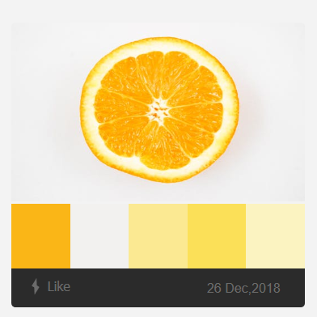
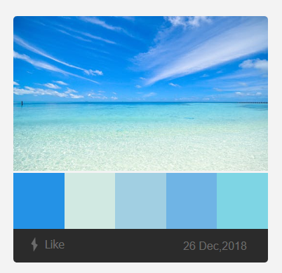
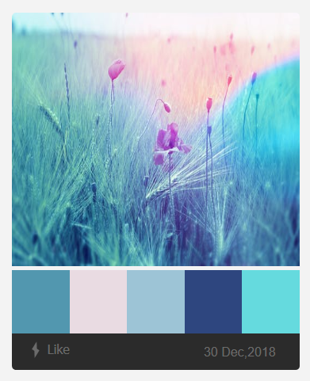
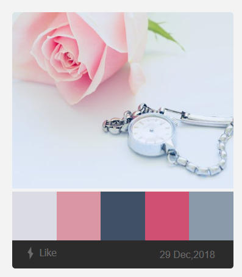

# Color Kik
This is an open source site to generate color palettes from images. Check the site at <a href="https://codedoubt.github.io/colorkik/">ColorKik</a>.
You can save your palettes by clicking the like button. They will be added to your browser 'local storage'. This website is using github to serve you pages so it does not store any kind of information about you. If you want to suggest any modification please fork the repo or <a href="https://twitter.com/vikrammouan">tweet</a> about it.

# following are the few samples from the site

  

    
